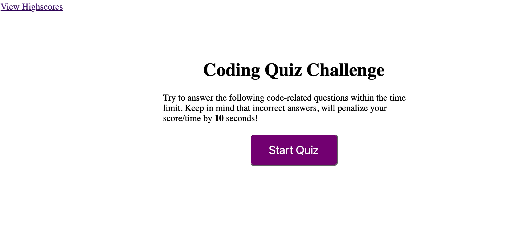
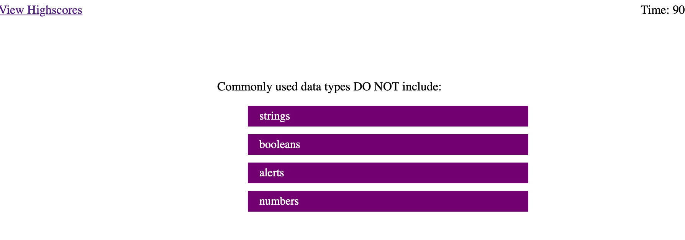
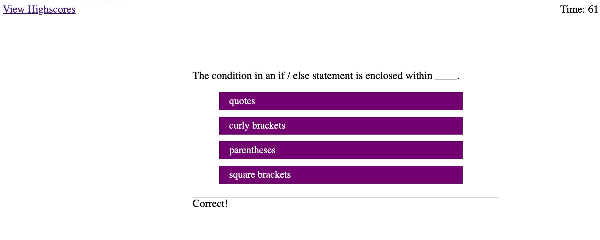
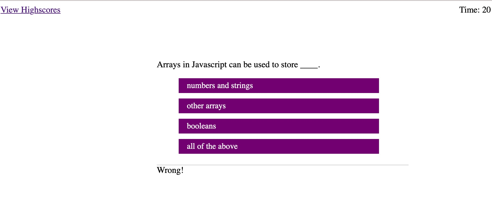
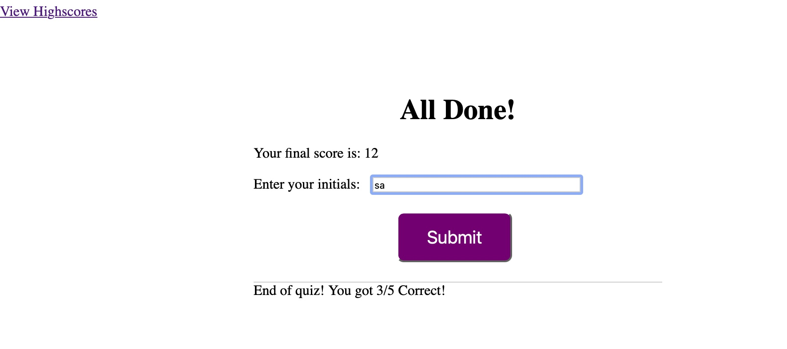
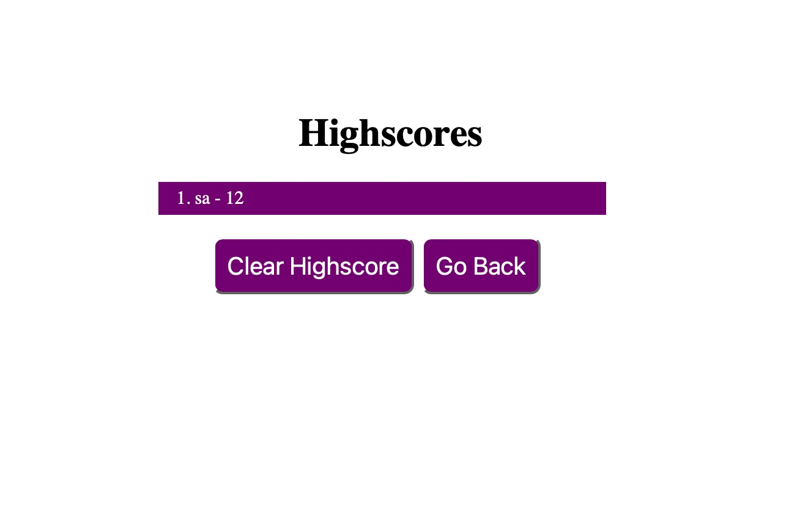

# code-quiz

This is a quiz application using HTML, CSS, and Javascript. This is project homework and designed to understand user of Javascript to dynamically create pages and use local storage to display highscore of the quiz using score card.  

This project has been deployed to GitHub Pages. To get this project up and running, you can follow the deployment link. Or, download the sources files to use this as a template.

* [Deployment link page](https://kumarakom.github.io/code-quiz/)
* [GitHub Repository](https://github.com/kumarakom/code-quiz)

## Table of Contents
Below are steps I had to follow to setup this project
- [Installation](#installation)
- [Usage](#usage)
- [Credits](#credits)
- [License](#license)

## Installation
The initial source was a file repostiory containg the a folder with html page, css and images folders.
* Created a new git repository, follow the documented [steps](GITHUB_SETUP.md)
* To clone this repository
  * Make sure you have right access to pull in the reposotiory either by applying 'ssh' keys or by providing a username and password'
  * Make sure your path is proper
  * Copy the git command to where you want to clone the repository
   ```
    git clone git@github.com:kumarakom/code-quiz
   ```
  * You will see a `code-quiz` folder
* An alternate document to clone a repo can also be found at [github](https://docs.github.com/en/github/creating-cloning-and-archiving-repositories/cloning-a-repository-from-github/cloning-a-repository)

## Execution
* git clone repository locally 
* change directory to `code-quiz` folder
* you will see a file "index.html"
* establish your current working dirctory or your preset working directory
* open file the "index.html" (using the path determined above) with any browser using 

### Usage 
* HTML and CSS and Javascript documents create a quiz with multiple choice questions with Javascript trivia
* Use Javascript to make dynamic changes to an HMTL document
* Use of appending HTML pages
* Use of local storage to save data

### Program features
* Click on "Start Quiz" button 
   * This should start a timers in seconds 
   * Each question is given 20 seconds, 5 questions, so a total of 101 seconds


* A dynamic html page is created with JS with question and choice of answers 
   * Image 1 : show begining of the program

   * Image 2 : shows when a correct choice made
 
   * Image 3 : shows when a wrong choice made 


* HTML appended page that features:
    * Final score based on calculated time remaining
    * A Summary of how many questions answered correctly
    * Input area to record initials
    * A Submit button which save to local storage 


* HTML page to display the highscores 
    * This a list summary of intials and final scores
    * Clear button resets the page and local storage
    * Go back button calls the main page 



## Credits

Key areas that helped me with Javascript were:

- Classroom examples and notes 
- [Web API Elements](https://developer.mozilla.org/en-US/docs/Web/API/Element)
- [Use of click elements](https://developer.mozilla.org/en-US/docs/Web/API/Element/click_event)
- [Json stringify](https://developer.mozilla.org/en-US/docs/Web/JavaScript/Reference/Global_Objects/JSON/stringify)

## License

This page is provided as is and the design and question sample belongs to
```
© 2021 Trilogy Education Services,
LLC, a 2U, Inc. brand.
Confidential and Proprietary. All Rights Reserved.
```
